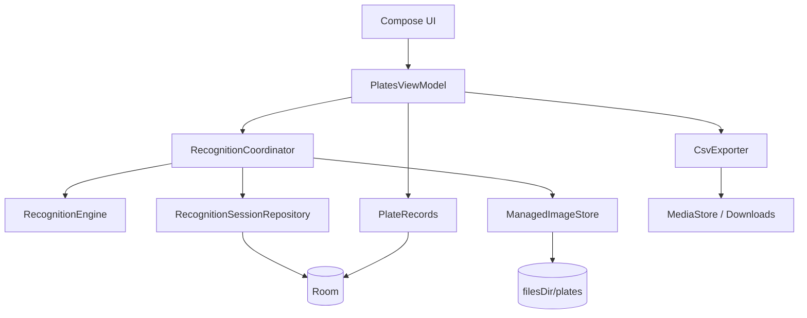

# Plate Recognizer Android v0.2.3 代码与架构改进建议

## 1. 审阅范围

- 仓库：`woner363/plate-recognizer-android`
- 分支：`main`
- 基线：`v0.2.3-debug` / `cdd19d9`
- 审阅重点：识别可信度、状态一致性、图片生命周期、CameraX 生命周期、数据层边界、可测试性和发布链路

现有验证结果：

- `PlateValidatorTest`：17/17 通过；
- `ImageStoreCleanupTest`：6/6 通过；
- `PlateRecognizerCandidateTest`：10/10 通过；
- Android Lint：0 errors、68 warnings；
- GitHub Actions 的 CI 与 Release workflow 均执行成功；
- `v0.2.3-debug` APK 的 SHA-256 与 Release 附件一致，APK Signature Scheme v2 验证通过。

## 2. 总体结论

当前项目采用 Compose + ViewModel + StateFlow + Room + CameraX + ML Kit，技术选择与项目规模匹配。暂时没有必要引入 Hilt、拆分多个 Gradle 模块或照搬大型 Clean Architecture。

主要问题不是“层数太少”，而是一次识别任务的数据被拆散在多个位置：

- 图片文件在 `filesDir/plates`；
- 待确认数据在 `SavedStateHandle`；
- 已确认记录在 Room；
- 正在处理、正在保存等状态在不同协程和 Boolean 中；
- UI 对话框还保留了一份局部输入状态。

这些状态没有统一的生命周期和状态迁移规则，因此产生重复保存、保存与放弃竞争、旧 pending 图片被清理、恢复后输入丢失等问题。

建议后续重构围绕一个持久化的 `RecognitionSession` 状态机展开，而不是继续给现有 ViewModel 增加更多 Boolean 和异常分支。

## 3. 优先级总览

| 优先级 | 修改项 | 主要风险 |
|---|---|---|
| P0 | 建立稳定签名与正确版本号 | 已发布 APK 无法覆盖升级，卸载会丢失本机数据 |
| P1 | 停止把格式启发式分数当成 OCR 置信度自动入库 | 合法外形的误识别会被静默保存 |
| P1 | 把确认、保存和放弃改成串行状态机 | 重复记录、保存后图片被删除、状态竞争 |
| P1 | 在业务层强制执行车牌校验 | UI 显示错误时仍能保存非法车牌 |
| P1 | 持久化 RecognitionSession，并统一图片引用 | 超过 24 小时的 pending 图片可能被误清理 |
| P1 | 明确“离线识别”与网络遥测边界 | APK 含网络权限，却向用户显示“本地离线” |
| P2 | 完善 CameraX 绑定与释放 | 页面销毁后相机仍可能保持绑定，ROI 降级后不再恢复 |
| P2 | 为核心组件建立可替换接口 | ViewModel 难以使用 fake 编写可靠状态测试 |
| P2 | 收紧文件、MediaStore 和删除操作的一致性 | 部分文件、空导出项和孤儿数据残留 |
| P2 | 清理 Lint、资源和发布体积问题 | 技术债积累，Debug APK 体积过大 |

## 4. 详细修改建议

### 4.1 P0：建立稳定签名与正确版本号

涉及文件：

- [`app/build.gradle.kts`](app/build.gradle.kts)
- [`.github/workflows/release.yml`](.github/workflows/release.yml)

#### 当前问题

Release workflow 执行 `assembleDebug`，GitHub 托管 Runner 会生成自己的临时 Debug Key。实测：

- `v0.2.2-debug` 与 `v0.2.3-debug` 的签名证书不同；
- Android 会拒绝使用 `adb install -r` 覆盖安装；
- 如果用户先卸载旧版再安装新版，Room 数据和私有图片都会被删除。

同时，APK Manifest 中仍是：

```kotlin
versionCode = 1
versionName = "1.0.0"
```

它与 `v0.2.3-debug` 标签不一致，也无法形成可靠的升级序列。

#### 建议修改

1. 创建专用、长期稳定的签名密钥；
2. 将 keystore、alias 和密码以 GitHub Actions Secrets 保存；
3. 新增 `staging` 或正式 `release` 构建类型，不再把临时 Debug Key 产物作为可升级 Release；
4. 将版本号集中管理，例如：

   ```kotlin
   versionCode = 23
   versionName = "0.2.3-debug"
   ```

5. Release workflow 在上传前执行：

   ```bash
   apksigner verify --verbose --print-certs app.apk
   aapt2 dump badging app.apk
   ```

6. 在 workflow 中比较本次证书指纹与仓库配置的预期指纹，不一致直接失败；
7. 如果仍保留 Debug Release，至少提交一份明确标记“仅用于测试”的固定 debug keystore；该密钥不能用于正式发行。

如果旧版签名密钥已经丢失，则无法让新包获得对旧安装的覆盖升级能力。需要在 Release Note 明确提示用户先导出数据，再卸载旧版。

#### 验收标准

- 连续两次 CI 构建的签名证书指纹完全一致；
- `v0.2.3` 可以通过 `adb install -r` 升级到 `v0.2.4`；
- 升级后数据库记录和图片仍存在；
- APK 内 `versionName`、`versionCode` 与 Release 标签一致；
- CI 在签名或版本不匹配时停止发布。

---

### 4.2 P1：不要把格式启发式分数当作 OCR 置信度

涉及文件：

- [`PlateRecognizer.kt`](app/src/main/java/com/example/platerecognizer/ocr/PlateRecognizer.kt)
- [`Recognition.kt`](app/src/main/java/com/example/platerecognizer/ocr/Recognition.kt)
- [`PlatesViewModel.kt`](app/src/main/java/com/example/platerecognizer/ui/PlatesViewModel.kt)

#### 当前问题

`pickBestCandidate()` 使用以下公式生成 `confidence`：

```kotlin
val conf = (0.85f + scoreValid(best.plate) * 0.013f)
    .coerceIn(0.85f, 0.98f)
```

普通 7 位号牌会因长度直接获得 `+10`，因此通常得到 `0.98`。ViewModel 随后使用 `confidence >= 0.9f` 自动入库。

这个数值不是 ML Kit 返回的字符识别概率，而是“格式是否合法、长度是否常见”的排序分数。它不能回答 OCR 是否把 `8` 识别成了 `B`，也不能证明画面中的真实车牌就是该字符串。

当前几何 bonus 仅用于多个候选之间排序，最终返回的仍是原启发式 confidence，因此不会提高自动保存判断的可信度。

#### 建议修改

短期安全方案：

1. 所有 OCR 结果都进入人工确认；
2. 将字段重命名为 `qualityScore` 或 `candidateScore`，避免误导；
3. UI 可以展示“候选质量”，但不要展示为精确百分比；
4. 在没有真实校准数据前删除 `>= 0.9` 自动入库路径。

如果确实需要自动保存，应建立可校准的评分模型，至少包含：

- 候选在多个 TextBlock / TextElement 中的一致性；
- 文字框面积、位置、长宽比和 ROI 覆盖率；
- 连续多帧识别结果是否一致；
- 候选唯一性及第一、第二候选差距；
- 真实车牌测试集上的准确率、召回率和误保存率。

只有在真实数据集上验证过的阈值，才应被用于跳过人工确认。

#### 验收标准

- 仅满足格式规则的候选不会自动保存；
- 对 `8/B`、`0/D`、`5/S` 等合法字符误识别样例必须进入确认；
- `Recognition` 明确区分模型输出、候选排序分数和是否需要确认；
- 自动保存阈值有测试集和误保存率依据；
- 单元测试不再把“格式合法”直接断言为“高置信度”。

---

### 4.3 P1：将识别流程重构为串行状态机

涉及文件：

- [`PlatesViewModel.kt`](app/src/main/java/com/example/platerecognizer/ui/PlatesViewModel.kt)
- [`MainScreen.kt`](app/src/main/java/com/example/platerecognizer/ui/MainScreen.kt)
- [`PlateInputDialog.kt`](app/src/main/java/com/example/platerecognizer/ui/PlateInputDialog.kt)

#### 当前问题

识别阶段使用了 `Mutex`，但人工确认阶段没有纳入同一个状态机：

- 用户连续点击“保存记录”，会启动多个 `repo.add()`；
- Room 主键自动生成，不会阻止重复行；
- 保存尚未完成时关闭对话框，会调用 `discardPending()` 删除图片；
- 先启动的保存协程仍可能成功，最终数据库记录指向已删除图片；
- 保存过程中没有 `isSaving`，按钮、返回键和点击外部区域仍可触发冲突操作。

#### 建议修改

使用单一状态表达当前工作流：

```kotlin
sealed interface RecognitionUiState {
    data object Ready : RecognitionUiState
    data object Capturing : RecognitionUiState
    data object Recognizing : RecognitionUiState
    data class AwaitingConfirmation(val session: RecognitionSession) : RecognitionUiState
    data class Saving(val session: RecognitionSession) : RecognitionUiState
    data class Discarding(val session: RecognitionSession) : RecognitionUiState
    data class Failed(val message: String, val recoverable: Boolean) : RecognitionUiState
}
```

所有动作都通过一个 reducer 或串行命令入口处理：

```text
Ready
  → Capturing / Importing
  → Recognizing
  → AwaitingConfirmation
  → Saving → Ready
  → Discarding → Ready
```

具体要求：

1. `confirmPending()` 使用 Mutex 或原子状态转换，只有第一次调用有效；
2. 进入 `Saving` 后禁用保存、取消、返回键和外部点击；
3. `discardPending()` 仅允许从 `AwaitingConfirmation` 进入；
4. 保存成功后再清 pending；
5. 保存失败恢复为 `AwaitingConfirmation`，允许重试；
6. 不使用多个彼此独立的 Boolean 描述同一流程。

#### 验收标准

- 连续点击保存 10 次只生成一条记录；
- 保存过程中执行返回或取消不会删除已保存记录的图片；
- 保存失败后输入和图片仍然存在；
- 任意时刻只存在一个有效的识别 Session；
- 使用协程测试覆盖确认、放弃、取消和数据库异常的交错顺序。

---

### 4.4 P1：将车牌校验提升为业务层不变量

涉及文件：

- [`PlateInputDialog.kt`](app/src/main/java/com/example/platerecognizer/ui/PlateInputDialog.kt)
- [`PlatesViewModel.kt`](app/src/main/java/com/example/platerecognizer/ui/PlatesViewModel.kt)
- [`PlateRepository.kt`](app/src/main/java/com/example/platerecognizer/data/PlateRepository.kt)

#### 当前问题

对话框虽然显示 `PlateValidator.describeError()`，保存按钮却只检查：

```kotlin
enabled = normalized.isNotEmpty()
```

因此格式错误但非空的车牌仍可保存。ViewModel 和 Repository 只检查非空，无法防止 UI 漏洞或未来其他调用方绕过校验。

#### 建议修改

1. UI 保存按钮使用 `enabled = error == null && !isSaving`；
2. ViewModel 在确认和修正入口再次调用 Validator；
3. Repository 或领域服务接收 `ValidatedPlate`，而不是任意 `String`：

   ```kotlin
   @JvmInline
   value class ValidatedPlate private constructor(val value: String) {
       companion object {
           fun parse(raw: String): Result<ValidatedPlate>
       }
   }
   ```

4. 明确是否允许人工强制保存非法格式。如果允许，应设计单独的“仍然保存”操作并记录原因，而不是让普通保存按钮静默绕过规则。

#### 验收标准

- 格式错误时普通保存按钮不可用；
- 直接调用 ViewModel 或 Repository 也无法保存非法字符串；
- 修正记录和首次确认遵守同一规则；
- 如果支持强制保存，数据库能区分“校验通过”和“人工覆盖”。

---

### 4.5 P1：持久化 RecognitionSession，统一 pending 和图片生命周期

涉及文件：

- [`PlatesViewModel.kt`](app/src/main/java/com/example/platerecognizer/ui/PlatesViewModel.kt)
- [`ImageStore.kt`](app/src/main/java/com/example/platerecognizer/data/ImageStore.kt)
- [`PlateRecognizerApp.kt`](app/src/main/java/com/example/platerecognizer/PlateRecognizerApp.kt)
- [`PlateDao.kt`](app/src/main/java/com/example/platerecognizer/data/PlateDao.kt)

#### 当前问题

pending 使用 `SavedStateHandle`，孤儿清理只读取 Room 中已保存记录的 URI。Application 启动清理发生在 Activity 和 ViewModel 恢复 pending 之前。

如果一个待确认任务超过 24 小时：

1. pending 仍可能被系统恢复；
2. 图片不在 `plates` 表引用集合中；
3. 启动清理会把图片当作孤儿删除；
4. 用户确认后，数据库保存一个已经失效的 URI。

`SavedStateHandle` 适合恢复 UI 状态，不适合充当包含文件所有权的长期业务存储。

#### 建议修改

新增持久化实体：

```kotlin
@Entity(tableName = "recognition_sessions")
data class RecognitionSessionEntity(
    @PrimaryKey val id: String,
    val state: String,
    val candidate: String?,
    val qualityScore: Float?,
    val imageUri: String,
    val error: String?,
    val createdAt: Long,
    val updatedAt: Long,
)
```

建议状态：

- `CAPTURING`
- `RECOGNIZING`
- `AWAITING_CONFIRMATION`
- `SAVING`
- `SAVED`
- `DISCARDED`
- `FAILED`

图片清理时应保留：

- `PlateRecord` 引用的图片；
- 非终态 `RecognitionSession` 引用的图片；
- 本轮正在写入的临时文件。

仅对“无任何数据库引用并超过保留期”的文件执行删除。终态 Session 可在确认或放弃后清除。

#### 验收标准

- pending 超过 24 小时后重新打开应用，图片仍存在；
- 强制结束进程、系统回收和 Activity 重建后 Session 可恢复；
- 清理任务不会删除任何非终态 Session 的图片；
- 确认后 Session 与正式记录之间没有悬空引用；
- 放弃后 Session 和图片最终都被清理。

---

### 4.6 P1：明确真正的离线与隐私边界

涉及文件：

- [`DashboardComponents.kt`](app/src/main/java/com/example/platerecognizer/ui/DashboardComponents.kt)
- [`AndroidManifest.xml`](app/src/main/AndroidManifest.xml)
- [`README.md`](README.md)

#### 当前问题

UI 显示“本地离线”，README 写明“无需联网”。Bundled ML Kit 模型确实可以在无网络环境完成 OCR，但最终 APK 通过 Google DataTransport 合并了：

- `android.permission.INTERNET`
- `android.permission.ACCESS_NETWORK_STATE`
- DataTransport backend/service

这不等于图片一定被上传，但表示应用并非严格意义上的“无网络能力”。当前用户文案没有区分“识别在本地完成”和“应用完全不联网”。

#### 建议修改

二选一：

1. **严格离线模式**
   - 通过 Manifest merger 删除网络权限和不需要的 DataTransport 组件；
   - 在断网和移除权限后验证 ML Kit 初始化与识别；
   - 使用 `aapt2 dump badging` 确认最终 APK 不含网络权限；
   - 增加自动化检查，发现 `INTERNET` 权限就让 Release 失败。

2. **允许诊断遥测**
   - UI 改为“本地识别”；
   - README 和隐私说明明确是否存在 SDK 诊断数据；
   - 不宣称整个应用完全离线；
   - 明确说明照片和车牌文本是否会离开设备。

#### 验收标准

- 产品文案与最终 APK 权限一致；
- 严格离线方案下 APK 不含 `INTERNET` 权限；
- 断网环境可以完成首次启动、拍照、OCR、保存和导出；
- README 提供清晰、可验证的隐私说明。

---

### 4.7 P2：完善 CameraX 绑定、重试与释放

涉及文件：

- [`CameraPreviewCard.kt`](app/src/main/java/com/example/platerecognizer/ui/CameraPreviewCard.kt)
- [`PhotoCapturer.kt`](app/src/main/java/com/example/platerecognizer/camera/PhotoCapturer.kt)

#### 当前问题

- Camera Provider 在 `AndroidView.factory` 内直接绑定；
- 每次创建都调用 `provider.unbindAll()`，会影响同一进程内其他 CameraX 用例；
- Composable 移除时没有对应的 `unbind(preview, imageCapture)`；
- `viewPort == null` 时会降级绑定，但布局完成后不会再次尝试带 ViewPort 绑定；
- 相机“已就绪”状态在真正完成绑定前就可能显示；
- 平台 `android.media.ExifInterface` 被 Lint 标记为不推荐，应改用 AndroidX 实现。

#### 建议修改

可选方案：

1. 使用 `LifecycleCameraController` 管理 Preview 和 ImageCapture；或
2. 建立 `CameraSession`/`CameraController` 类，把绑定逻辑移出 Composable；
3. 在 `AndroidView.onRelease` 或 `DisposableEffect` 中只解绑本页面拥有的用例；
4. 使用 `doOnLayout` / `awaitLayout` 获取非空 ViewPort，不采用永久降级；
5. 将 `CameraState` 暴露为 `Initializing / Ready / Error`；
6. 使用 `androidx.exifinterface.media.ExifInterface`；
7. 为 EXIF 镜像方向 2/4/5/7 增加处理或明确不支持。

#### 验收标准

- 离开页面后相机立即释放；
- 反复进入页面不会累积绑定或出现“相机已被占用”；
- ViewPort 首次为空时可以在布局完成后恢复正确绑定；
- 错误状态与真实相机状态一致；
- ROI 在至少两种传感器方向和不同宽高比设备上对齐。

---

### 4.8 P2：保留手动 DI，但建立可替换接口

涉及文件：

- [`AppContainer.kt`](app/src/main/java/com/example/platerecognizer/AppContainer.kt)
- [`PlatesViewModel.kt`](app/src/main/java/com/example/platerecognizer/ui/PlatesViewModel.kt)
- [`PlateRepository.kt`](app/src/main/java/com/example/platerecognizer/data/PlateRepository.kt)
- [`PlateRecognizer.kt`](app/src/main/java/com/example/platerecognizer/ocr/PlateRecognizer.kt)

#### 当前问题

`AppContainer` 注释称测试可以替换依赖，但实际字段是 `val`，实现类也是具体类型。ViewModel 直接依赖：

- `PlateRepository`
- `PlateRecognizer`
- `ImageStore`

目前没有 mocking 库，也没有这些组件的接口，因此核心状态流程难以用 fake 做 JVM 单测。

#### 建议修改

不需要引入 Hilt，只需定义最小接口：

```kotlin
interface PlateRecords {
    fun observeAll(): Flow<List<PlateRecord>>
    suspend fun add(...): Long
    suspend fun update(...)
    suspend fun delete(...)
}

interface RecognitionEngine {
    suspend fun recognize(uri: Uri): Recognition?
}

interface ManagedImageStore {
    suspend fun import(source: Uri): Uri
    suspend fun delete(uri: Uri): Boolean
}
```

`AppContainer` 负责把接口绑定到真实实现；测试直接传入 fake。CSV 导出可以拆成 `CsvExporter`，避免 Repository 同时负责数据库、文件系统和 MediaStore。

#### 验收标准

- ViewModel JVM 测试不需要 Android Context 或 ML Kit；
- 可以注入“识别失败”“保存失败”“删除失败”和延迟返回的 fake；
- AppContainer 注释与实际可替换能力一致；
- 不增加不必要的多模块或大型 DI 框架复杂度。

---

### 4.9 P2：收紧文件和 MediaStore 一致性

涉及文件：

- [`ImageStore.kt`](app/src/main/java/com/example/platerecognizer/data/ImageStore.kt)
- [`PlateRepository.kt`](app/src/main/java/com/example/platerecognizer/data/PlateRepository.kt)

#### 建议修改

1. 相册导入先写 `.tmp` 文件，复制成功并 `fsync` 后原子重命名；
2. 文件命名加入 UUID，避免仅依赖毫秒时间戳；
3. 数据库删除与文件删除记录失败状态，交给后台重试，而不是完全静默；
4. 复用 `ImageStore.deleteOwned()`，删除 Repository 内重复且边界更宽松的路径判断；
5. 路径前缀判断必须包含 `File.separator`；
6. MediaStore 导出使用 `IS_PENDING=1 → 写入 → IS_PENDING=0`；
7. 创建 MediaStore 项后写入失败，应删除已创建的空文件；
8. CSV 导出器从 Repository 中拆出，单独测试编码、失败回滚和 Android 版本分支。

#### 验收标准

- 导入中断不会留下可被误认为完成图片的半文件；
- 删除失败可观测并最终重试；
- 导出失败后 Downloads 不留下空文件；
- 文件路径判断不会把相似前缀目录误认为应用私有目录。

---

### 4.10 P2：清理 Lint、UI 状态和发布体积问题

#### 当前问题

- 当前 Lint 为 0 errors，但仍有 68 warnings；
- `PlateInputDialog` 使用 `remember`，Activity 重建会丢失用户已经修改的车牌和备注；
- 删除记录没有确认或撤销，数据库与图片会立即删除；
- 多数 Compose 文案硬编码，现有 `strings.xml` 大量未使用；
- Activity 固定竖屏，平板、折叠屏和 ChromeOS 会被 letterbox；
- Release 实际上传 Debug APK，包含调试工具、未压缩代码和全部 ABI，体积约 59 MB。

#### 建议修改

1. 对话框输入改为 `rememberSaveable`，更理想的是由 Session/ViewModel 持有；
2. 删除操作增加确认或 Snackbar Undo；
3. 将 UI 文案统一迁移到 string resources；
4. 删除废弃资源并补充 monochrome launcher icon；
5. 在 ROI 映射适配后解除固定竖屏；
6. 建立正式 release 构建，开启 R8 和资源压缩；
7. 根据分发方式使用 App Bundle 或 ABI splits；
8. 逐项处理 Lint 中的 `ExifInterface`、固定方向和依赖升级提醒。

## 5. 建议目标架构



职责说明：

- `PlatesViewModel`：接收 UI intent，暴露单一 `UiState`；
- `RecognitionCoordinator`：串行执行拍摄、OCR、确认、保存、放弃；
- `RecognitionSessionRepository`：持久化非终态任务及图片引用；
- `PlateRecords`：只管理正式记录；
- `ManagedImageStore`：统一管理临时、pending 和正式图片；
- `CsvExporter`：隔离 Android MediaStore 和 CSV 编码；
- UI 不直接决定业务不变量，也不持有具有文件所有权的长期状态。

## 6. 建议测试矩阵

### 6.1 ViewModel / Coordinator JVM 测试

- 快速点击两次拍照，仅启动一次识别；
- 快速点击十次保存，仅生成一条记录；
- 保存中点击取消，不删除正式记录图片；
- 保存失败后恢复待确认状态；
- 放弃失败后进入可重试清理状态；
- 非法车牌无法通过业务入口保存；
- 进程恢复时读取持久化 Session。

### 6.2 Room / 文件 Instrumentation 测试

- Session 到正式记录的状态迁移；
- 旧 pending 图片不会被孤儿清理；
- 无引用旧文件会被删除；
- 数据库异常时文件不会失去所有权记录；
- Migration 保留记录、Session 和图片 URI。

### 6.3 Camera / OCR 测试

- ROI 边缘目标裁剪结果与预览一致；
- EXIF 0/90/180/270 及镜像方向；
- 12MP/48MP 图片内存峰值；
- 多个合法候选时排序稳定；
- 合法外形误识别不会自动入库；
- 真实样本集记录准确率、召回率和误保存率。

### 6.4 Release 验证

- 签名证书指纹与预期一致；
- `versionCode` 单调递增；
- `versionName` 与 Tag 一致；
- 从上一版本覆盖安装成功且数据保留；
- SHA-256、提交 SHA 和构建环境写入 Release；
- 严格离线模式下 APK 不含网络权限。

## 7. 推荐实施顺序

### 第一阶段：阻止升级和数据损失

1. 固定签名密钥；
2. 修正版本号；
3. 更新 Release workflow 的签名和版本验证；
4. 修正现有 Release 的升级说明。

### 第二阶段：立即收紧正确性

1. 暂停基于启发式 confidence 的自动保存；
2. 禁止非法车牌普通保存；
3. 增加 `Saving` 状态并防重复确认；
4. 保存期间禁止放弃和关闭；
5. 补齐 ViewModel 并发测试。

### 第三阶段：统一业务状态和图片生命周期

1. 增加 `RecognitionSession` Room 表；
2. 把 pending 从 SavedStateHandle 主存储迁到 Room；
3. 实现串行 `RecognitionCoordinator`；
4. 让孤儿清理读取正式记录和非终态 Session；
5. 增加恢复、清理和 Migration 测试。

### 第四阶段：整理边界与设备兼容性

1. 引入最小接口并使用 manual DI；
2. 拆分 `CsvExporter`；
3. 完善 CameraX 生命周期；
4. 适配旋转、平板和折叠屏；
5. 清理 Lint 和资源问题。

### 第五阶段：发布质量

1. 明确隐私与离线策略；
2. 建立正式 release 构建；
3. 开启压缩和 ABI/App Bundle 分发；
4. 在 CI 中加入升级安装和 APK 权限检查。

## 8. 完成定义

达到以下条件后，项目可认为从“功能可用的调试版本”进入“可持续升级的可靠版本”：

- APK 使用稳定签名，版本号正确且可以覆盖升级；
- 不再使用未校准的启发式分数跳过人工确认；
- 确认、保存和放弃不存在重复或竞争；
- pending 与图片引用由持久化 Session 统一管理；
- 业务层无法保存非法车牌；
- 产品离线/隐私描述与最终 APK 权限一致；
- ViewModel、Room、图片生命周期和升级流程均有自动化回归测试；
- CI 不仅“能够构建”，还能阻止签名、版本、权限和状态一致性回归。
