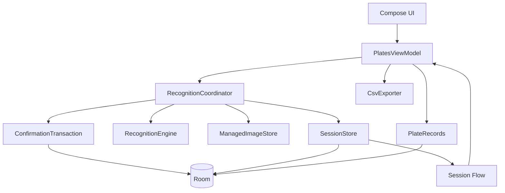

# Plate Recognizer Android v0.2.7 当前问题与改进建议

## 1. 审阅基线

- 分支：`main`
- 提交：`c8ac83c`
- 标签：`v0.2.7-debug`
- 工作树：审阅开始时干净
- 审阅日期：2026-07-06

审阅范围包括：

- 识别 Session 状态机及进程恢复；
- Room 数据结构与 Migration；
- 正式记录、图片和 CSV 的一致性；
- CameraX 生命周期；
- OCR 候选质量语义；
- 手动依赖注入接口；
- CI、签名和版本发布；
- 当前测试与 Lint 覆盖。

仓库现有本地测试报告显示：

- `PlateValidatorTest`：17/17 通过；
- `PlateRecognizerCandidateTest`：10/10 通过；
- `ImageStoreCleanupTest`：6/6 通过；
- `CsvExporterTest`：6/6 通过；
- 合计：39/39 JVM 测试通过；
- 最近的本地 Lint 报告：0 errors、70 warnings。

当前没有 `androidTest`，也没有 ViewModel、RecognitionSession、Room Migration 或 CameraX 自动化测试。

## 2. 已完成的有效改进

相较于 `v0.2.3-debug`，以下改进方向是正确的：

- 已取消根据启发式分数自动入库，所有 OCR 结果进入人工确认；
- `confidence` 在 OCR 层已更名为 `qualityScore`，避免把格式评分伪装成模型概率；
- UI 和 ViewModel 都会校验人工输入；
- 新增 `recognition_sessions` 表，pending 图片不再只依赖 `SavedStateHandle`；
- 相册导入改为 `.tmp → fsync → rename`；
- CSV 导出加入 MediaStore `IS_PENDING` 和失败回滚；
- 删除记录前增加确认；
- 对话框输入改用 `rememberSaveable`；
- CameraX 增加布局后绑定和释放处理；
- ViewModel 开始依赖最小接口；
- Release keystore 已改为 GitHub Secret 恢复，解决跨 Tag 缓存不稳定问题；
- 版本号已更新为 `versionCode=27`、`versionName=0.2.7-debug`。

这些修改解决了上一轮评审中的多数表面问题，但新状态机仍然有“双重状态源”和非幂等恢复问题，需要优先处理。

## 3. 优先级总览

| 优先级 | 问题 | 主要影响 |
|---|---|---|
| P0 | Room Session 观察器会把 `SAVING`/`DISCARDING` 覆盖成待确认 | 保存按钮重新启用，可能重复入库或保存已删除图片 |
| P1 | 拍照、导入或 Session 创建失败后 UI 永久停在 `Capturing` | 用户无法继续识别，只能重启应用 |
| P1 | 进程在 `SAVING`/`DISCARDING` 中终止时恢复不幂等 | 重复记录、失效图片 URI、错误恢复操作 |
| P1 | Session 状态迁移没有数据库级前置条件 | 任意状态可跳转，并发写入会覆盖彼此 |
| P1 | 数据库允许多个非终态 Session | 旧任务会变成幽灵 pending，并长期保护孤儿图片 |
| P1 | 核心状态机没有自动化测试 | 当前 P0/P1 回归可以在 39 个测试全绿时进入 Release |
| P2 | 所谓 domain 接口仍泄露 Android 和 data/Room 类型 | JVM 测试仍依赖 Android stub，边界不够稳定 |
| P2 | `qualityScore` 在数据库、README 和 CSV 中仍叫“置信度” | 外部数据和用户理解继续受到误导 |
| P2 | CameraX 仍使用异步 `unbindAll()` | 旧页面释放可能误解绑新页面或其他 CameraX 用例 |
| P2 | Release 缺少 Tag、Manifest 版本和证书的强制闭环 | 配置遗漏时仍可能发布错误版本或跳过证书比对 |
| P2 | Repository 业务校验和文件操作仍有边缘缺口 | 非 UI 调用可绕过规则，导出可能残留 pending 项 |
| P3 | README、注释、Lint 与实际代码不同步 | 维护者对架构能力和当前行为形成错误判断 |

## 4. 详细问题与修改建议

### 4.1 P0：Session 观察器破坏了状态机的 CAS 保护

涉及文件：

- [`PlatesViewModel.kt`](app/src/main/java/com/example/platerecognizer/ui/PlatesViewModel.kt)
- [`RecognitionSessionRepository.kt`](app/src/main/java/com/example/platerecognizer/data/RecognitionSessionRepository.kt)

#### 当前问题

ViewModel 同时存在两个状态写入源：

1. 命令处理函数直接写 `_uiState`；
2. `sessions.observeActive()` 的长期 collector 也会写 `_uiState`。

collector 对所有非空 Session 都执行：

```kotlin
_uiState.value = RecognitionUiState.AwaitingConfirmation(active)
```

它没有根据 `active.state` 映射 `CAPTURING`、`RECOGNIZING`、`SAVING` 或 `DISCARDING`。

保存时的实际时序为：

```text
AwaitingConfirmation
  → compareAndSet(Saving)
  → Room transition(SAVING)
  → Room Flow 发出 SAVING Session
  → collector 把 UI 改回 AwaitingConfirmation
  → 保存按钮重新启用
  → 第二次 confirmPending 可以再次进入 Saving
```

放弃流程存在相同问题。`DISCARDING` 写入 Room 后，UI 会重新变成待确认，此时用户可能在图片删除过程中再次点击保存。

因此，当前 CAS 并没有真正防止重复保存或保存/放弃竞争。

#### 建议修改

必须选择单一状态源。

推荐方案：Room Session 为业务状态的唯一来源，ViewModel 只映射，不手工维护同义状态。

```kotlin
val uiState: StateFlow<RecognitionUiState> =
    sessions.observeActive()
        .map(::mapSessionToUiState)
        .stateIn(
            scope = viewModelScope,
            started = SharingStarted.WhileSubscribed(5_000),
            initialValue = RecognitionUiState.Ready,
        )

private fun mapSessionToUiState(session: ActiveSession?): RecognitionUiState = when {
    session == null -> RecognitionUiState.Ready
    session.state == SessionState.CAPTURING -> RecognitionUiState.Capturing
    session.state == SessionState.RECOGNIZING -> RecognitionUiState.Recognizing
    session.state == SessionState.AWAITING_CONFIRMATION ->
        RecognitionUiState.AwaitingConfirmation(session)
    session.state == SessionState.SAVING -> RecognitionUiState.Saving(session)
    session.state == SessionState.DISCARDING -> RecognitionUiState.Discarding(session)
    session.state == SessionState.FAILED ->
        RecognitionUiState.Failed(session.error ?: "识别任务失败", recoverable = true)
    else -> RecognitionUiState.Ready
}
```

如果拍照发生在 Session 创建之前，可使用单独的短期 `captureState`，再与 Room 状态组合；不要让两个来源都随意覆盖同一个 `_uiState`。

#### 验收标准

- 写入 `SAVING` 后 UI 始终保持 Saving，直到数据库状态变化；
- 写入 `DISCARDING` 后保存和取消按钮始终不可用；
- 连续点击保存不会生成重复记录；
- 保存和放弃不能同时成功；
- 状态映射测试覆盖每一个 `SessionState`。

---

### 4.2 P1：失败路径会让 UI 永久停在 Capturing

涉及文件：[`PlatesViewModel.kt`](app/src/main/java/com/example/platerecognizer/ui/PlatesViewModel.kt)

#### 当前问题

`launchRecognition()` 在启动协程前执行：

```kotlin
_uiState.value = RecognitionUiState.Capturing
```

但 `finally` 只释放 Mutex：

```kotlin
finally {
    recognitionMutex.unlock()
}
```

以下路径会提前返回，却没有恢复 Ready：

- `capture()` 抛异常；
- `imageStore.importToLocal()` 抛异常；
- `sessions.createCapturing()` 抛异常；
- 首次 Session transition 失败；
- 协程在创建持久 Session 前被取消。

此时 `isProcessing` 一直为 true，拍照和相册按钮永久禁用。Mutex 虽然已经释放，但用户没有入口再启动任务。

#### 建议修改

让识别入口返回明确结果，不在内部 catch 后静默 `return@launchRecognition`：

```kotlin
private fun launchRecognition(block: suspend () -> Unit) {
    if (!recognitionMutex.tryLock()) return
    transientState.value = CaptureState.Capturing
    viewModelScope.launch {
        try {
            block()
        } catch (e: CancellationException) {
            throw e
        } catch (e: Exception) {
            emit(UiEvent.Toast(e.message ?: "识别任务失败"))
        } finally {
            recognitionMutex.unlock()
            if (sessions.currentActive() == null) {
                transientState.value = CaptureState.Idle
            }
        }
    }
}
```

如果图片已经创建但 Session 创建失败，还应删除本轮图片或把它登记为可恢复任务。

#### 验收标准

- 模拟相机保存失败后按钮恢复可用；
- 模拟相册读取失败后按钮恢复可用；
- 模拟 Room 写入失败后不会卡在处理中；
- 失败路径不留下无引用的新图片；
- 每个异常路径都有 ViewModel 单元测试。

---

### 4.3 P1：进程恢复策略不是幂等的

涉及文件：

- [`PlatesViewModel.kt`](app/src/main/java/com/example/platerecognizer/ui/PlatesViewModel.kt)
- [`RecognitionSessionEntity.kt`](app/src/main/java/com/example/platerecognizer/data/RecognitionSessionEntity.kt)
- [`PlateRecord.kt`](app/src/main/java/com/example/platerecognizer/data/PlateRecord.kt)

#### 当前问题

应用恢复时，任何非终态 Session 都会被当作 `AwaitingConfirmation`。这对不同中断状态是不正确的。

##### 中断在 SAVING

可能出现：

1. `repo.add()` 已成功；
2. 进程在 `markSaved()` 前终止；
3. 重启后 Session 被恢复成待确认；
4. 用户再次保存；
5. 生成重复 PlateRecord。

正式记录没有 `sourceSessionId`，数据库无法判断本 Session 是否已经入库。

##### 中断在 DISCARDING

可能出现：

1. 图片已经删除；
2. 进程在 `markDiscarded()` 前终止；
3. 重启后恢复成待确认；
4. 用户保存；
5. 新记录指向不存在的图片。

##### 中断在 RECOGNIZING

恢复后 candidate 和 error 可能仍为空，却直接展示普通确认框，用户不知道 OCR 已被中断。

#### 建议修改

1. 为 `PlateRecord` 增加可空 `sourceSessionId`；
2. 对 `sourceSessionId` 建立唯一索引；
3. 使用同一 Room Database 的 `@Transaction` 完成：
   - 插入正式记录；
   - 将 Session 标记为 SAVED；
4. 插入采用幂等语义，同一 Session 重试不会产生第二条记录；
5. 启动恢复根据原状态执行补偿：

| 原状态 | 恢复动作 |
|---|---|
| `CAPTURING` | 若图片存在则转为识别；不存在则 FAILED |
| `RECOGNIZING` | 重跑 OCR，或转 Awaiting 并提示“识别被中断” |
| `AWAITING_CONFIRMATION` | 正常恢复确认框 |
| `SAVING` | 先按 `sourceSessionId` 查询；已入库则完成 Session，否则安全重试 |
| `DISCARDING` | 继续删除图片并完成 Session，不恢复保存入口 |
| `FAILED` | 展示明确的重试或放弃操作 |

#### 验收标准

- 在保存的每一个步骤强制杀进程，恢复后最多存在一条正式记录；
- 在放弃的每一个步骤强制杀进程，不会保存失效 URI；
- RECOGNIZING 中断后不会展示“正常识别完成”的假象；
- 重复执行恢复逻辑结果不变。

---

### 4.4 P1：状态迁移没有数据库级约束

涉及文件：

- [`Contracts.kt`](app/src/main/java/com/example/platerecognizer/domain/Contracts.kt)
- [`RecognitionSessionRepository.kt`](app/src/main/java/com/example/platerecognizer/data/RecognitionSessionRepository.kt)
- [`PlateDao.kt`](app/src/main/java/com/example/platerecognizer/data/PlateDao.kt)

#### 当前问题

`transition()` 采用“读取当前 Entity → copy → REPLACE”的方式：

```kotlin
val current = dao.getById(id) ?: return
dao.upsert(transform(current).copy(state = state))
```

问题包括：

- 不检查允许的前置状态；
- Session 不存在时静默成功；
- 两个协程读取同一旧值后，后写入者覆盖先写入者；
- 接口允许调用方传入任意 `RecognitionSessionEntity` transform；
- 所谓状态机只存在于注释中，数据库不执行状态规则。

#### 建议修改

使用带 expected state 的原子更新：

```kotlin
@Query(
    """
    UPDATE recognition_sessions
    SET state = :nextState,
        updated_at = :updatedAt
    WHERE id = :id AND state = :expectedState
    """,
)
suspend fun transition(
    id: String,
    expectedState: SessionState,
    nextState: SessionState,
    updatedAt: Long,
): Int
```

返回值必须为 1，否则视为冲突或 Session 丢失。Repository 为每种业务动作提供窄 API，不暴露 Entity transform。

允许的迁移应集中定义并测试，例如：

```text
CAPTURING → RECOGNIZING / FAILED
RECOGNIZING → AWAITING_CONFIRMATION / FAILED
AWAITING_CONFIRMATION → SAVING / DISCARDING
SAVING → SAVED / AWAITING_CONFIRMATION
DISCARDING → DISCARDED / FAILED
FAILED → RECOGNIZING / DISCARDING
```

#### 验收标准

- 非法迁移返回冲突，不修改数据；
- Session 不存在不会被当作成功；
- 两个并发动作只有一个能完成迁移；
- Contracts 不再暴露 Room Entity transform；
- 所有合法和非法迁移都有测试。

---

### 4.5 P1：数据库允许多个活跃 Session

涉及文件：[`PlateDao.kt`](app/src/main/java/com/example/platerecognizer/data/PlateDao.kt)

#### 当前问题

`observeActive()` 使用 `ORDER BY updated_at DESC LIMIT 1`，这只是隐藏多余 Session，并没有保证唯一性。

一旦旧 Session 因异常未终结，又创建了新 Session：

- UI 只显示最近的一条；
- 孤儿清理会保留所有非终态 Session 图片；
- 最近 Session 删除后，旧 Session 会重新出现；
- 用户会看到“幽灵 pending”；
- 旧图片可能被永久保留。

当前 `FAILED` 被视为非终态，但 `markFailed()` 和 `RecognitionUiState.Failed` 基本没有形成完整处理流程。

#### 建议修改

可选方案：

1. 单任务应用直接使用固定主键，例如 `id="active"`；或
2. 创建新 Session 前用事务终结/拒绝已有活跃 Session；或
3. 增加“当前活跃任务”单独表，以外键指向 Session。

同时增加启动修复：扫描全部非终态 Session，根据状态恢复或终结，不能只取最新一条。

Session ID 建议改用 UUID，避免时间戳 + 进程内 counter 在进程重启后的碰撞风险。

#### 验收标准

- 任意时刻数据库最多存在一个非终态 Session；
- 无法通过并发调用创建两条活跃 Session；
- 启动时能处理历史异常遗留的多 Session 数据；
- 不会在完成当前任务后突然出现旧 pending。

---

### 4.6 P1：核心状态机测试缺失

涉及目录：[`app/src/test`](app/src/test)

#### 当前问题

现有 39 个测试主要覆盖：

- 车牌格式；
- OCR 文本候选纯函数；
- 孤儿清理纯函数；
- CSV 编码纯函数。

以下核心行为完全没有测试：

- ViewModel 状态转换；
- 保存与放弃竞争；
- 重复点击保存；
- 捕获/导入失败恢复；
- Session DAO 原子迁移；
- 进程中断补偿；
- Room 1→2 Migration；
- 图片与正式记录的一致性；
- CameraX 绑定与释放。

这就是为什么当前 P0 状态回归可以在所有测试全绿时进入 Release。

#### 建议修改

优先新增：

1. `PlatesViewModelTest`
   - 使用 fake `PlateRecords`、`RecognitionEngine`、`ManagedImageStore`、`RecognitionSessions`；
   - 使用 `StandardTestDispatcher` 和 `MainDispatcherRule`；
   - 覆盖快速重复操作与异常路径。
2. `RecognitionSessionRepositoryTest`
   - 使用内存 Room 或 DAO fake；
   - 测试合法/非法状态迁移和并发更新。
3. `Migration1To2Test`
   - 使用 `MigrationTestHelper`；
   - 验证旧 plates 数据完整保留。
4. 恢复场景测试
   - 分别从 CAPTURING、RECOGNIZING、SAVING、DISCARDING 恢复。

CI 至少应增加可在无设备环境运行的 ViewModel/Repository 测试。Migration 测试可以使用 emulator job 单独执行。

#### 验收标准

- 本文 4.1～4.5 的每个问题都有失败测试，再实现修复；
- 状态机分支覆盖率可观测；
- CI 能阻止重复保存和失败卡死回归；
- Migration 在发布前自动验证。

---

### 4.7 P2：domain 接口仍然泄露 Android 和 data 层

涉及文件：[`Contracts.kt`](app/src/main/java/com/example/platerecognizer/domain/Contracts.kt)

#### 当前问题

接口抽离改善了构造注入，但当前 `domain` 包仍直接依赖：

- `android.net.Uri`；
- `data.PlateRecord`；
- `data.ActiveSession`；
- `data.SessionState`；
- `data.RecognitionSessionEntity`，甚至暴露 Entity transform。

这会造成：

- domain 并没有真正脱离 Android/Room；
- 普通 JVM ViewModel 测试调用 `Uri.parse()` 时仍依赖 Android stub 或 Robolectric；
- Room Entity 结构变化会直接修改业务接口；
- fake 需要理解数据层实现细节。

#### 建议修改

1. 将 `PlateRecord`、`ActiveSession`、`SessionState` 等领域值对象移入 domain；
2. data 层 Entity 与 domain model 通过 mapper 转换；
3. 业务接口使用 `ImageRef` 或 String value class，而不是 Android Uri；
4. `RecognitionEngine` 的 Android 实现内部再转换为 Uri；
5. 删除 `transition(... transform: Entity -> Entity)` 这种数据层泄露接口；
6. `AppContainer` 继续手动装配即可，不需要为了接口引入 Hilt。

#### 验收标准

- domain 源码不 import `android.*`、Room Entity 或 data repository；
- ViewModel JVM 测试无需 Robolectric；
- Entity schema 调整不改变业务接口；
- fake 只实现业务语义。

---

### 4.8 P2：候选质量在持久层和导出中仍被称为置信度

涉及文件：

- [`PlateRecord.kt`](app/src/main/java/com/example/platerecognizer/data/PlateRecord.kt)
- [`PlateRepository.kt`](app/src/main/java/com/example/platerecognizer/data/PlateRepository.kt)
- [`CsvExporter.kt`](app/src/main/java/com/example/platerecognizer/data/CsvExporter.kt)
- [`README.md`](README.md)

#### 当前问题

OCR 层已经明确 `qualityScore` 不是模型概率，UI 也改为“高/中/低”。但正式记录仍保存到：

```kotlin
val confidence: Float
```

CSV 列名和 README 仍写“置信度”。外部使用者看到 `0.98` 时仍很容易理解为 98% OCR 正确概率。

#### 建议修改

1. Kotlin 字段改为 `qualityScore`；
2. CSV 列名改为“候选质量分”；
3. README 同步修改；
4. 如果不想立刻重命名数据库列，可暂时保留 `@ColumnInfo(name="confidence")` 做兼容，但代码语义必须更新；
5. 后续 Migration 再将列名正式迁移为 `quality_score`；
6. 导出文档说明分数仅用于候选排序，不是概率。

#### 验收标准

- UI、代码、数据库 schema 文档和 CSV 使用一致术语；
- 不再出现“0.98 = 98% 正确率”的暗示；
- CSV 测试验证新列名。

---

### 4.9 P2：CameraX 释放逻辑仍可能误解绑

涉及文件：[`CameraPreviewCard.kt`](app/src/main/java/com/example/platerecognizer/ui/CameraPreviewCard.kt)

#### 当前问题

绑定和释放都调用 `provider.unbindAll()`。释放逻辑通过新的 `ProcessCameraProvider.getInstance()` Future 异步执行。

潜在时序：

1. 旧 Composable 被销毁并注册异步 unbind；
2. 新 Composable 已经绑定新的 Preview/ImageCapture；
3. 旧释放回调稍后执行 `unbindAll()`；
4. 新页面的相机也被解绑。

此外，`doOnLayout` 内的 `viewPort` 仍然是 nullable；为空时继续构建无 ViewPort 的 UseCaseGroup，之后不会自动重试，所谓“不会永久降级”并未完全实现。

#### 建议修改

1. 保存本页面拥有的 `preview` 和 `imageCapture`；
2. 释放时调用 `provider.unbind(preview, imageCapture)`；
3. 不使用全局 `unbindAll()`；
4. 使用 `AndroidView.onRelease` 或一个拥有明确生命周期的 CameraController；
5. ViewPort 为空时等待下一次布局/预绘制，而不是永久无 ViewPort 绑定；
6. Camera 状态从真实绑定结果产生。

#### 验收标准

- 快速销毁并重建页面不会黑屏；
- 旧页面释放不会影响新页面；
- 同进程其他 CameraX 用例不受影响；
- 最终绑定一定包含 ViewPort，或给出明确不可用错误。

---

### 4.10 P2：发布闭环仍不完整

涉及文件：

- [`app/build.gradle.kts`](app/build.gradle.kts)
- [`.github/workflows/release.yml`](.github/workflows/release.yml)

#### 当前问题

固定 keystore Secret 是正确方向，但仍有以下问题：

- `CI_DEBUG_CERT_SHA256` 未设置时会跳过证书比对；
- workflow 没有验证 Tag 与 APK `versionName` 一致；
- 没有验证 `versionCode` 相比上一版本递增；
- 任意 `v*` Tag 都会触发发布，不检查是否来自 `main`；
- `release` build type 在本地无环境变量时回退到默认 Debug Key；
- release build 仍关闭压缩，并使用 debug key 语义；
- 注释仍写“keystore 不是机密、可放 cache”，与当前 Secret 实现矛盾；
- GitHub Actions 使用可变版本标签，没有固定到 commit SHA。

#### 建议修改

1. 要求证书指纹变量必须存在，不允许跳过；
2. 使用 `aapt2 dump badging` 提取 APK versionName/versionCode 并比对 Tag；
3. 限制 Tag 格式，例如 `v[0-9]+.[0-9]+.[0-9]+-debug`；
4. 验证 Tag 提交可从 `origin/main` 到达；
5. 正式 release signingConfig 缺少密钥时直接失败，不回退 Debug Key；
6. 为签名密钥保留离线加密备份和轮换说明；
7. 将生产 Release 与测试 Debug Release 的命名和密钥策略分开；
8. 对关键 Actions 固定 commit SHA。

#### 验收标准

- 缺失指纹、版本不匹配或 Tag 来源错误时 workflow 失败；
- release 构建不可能被默认 Debug Key 静默签名；
- 连续版本可覆盖升级且 versionCode 单调递增；
- 文档、注释和 Secret 策略一致。

---

### 4.11 P2：Repository 业务不变量和文件边缘处理仍不完整

涉及文件：

- [`PlateRepository.kt`](app/src/main/java/com/example/platerecognizer/data/PlateRepository.kt)
- [`CsvExporter.kt`](app/src/main/java/com/example/platerecognizer/data/CsvExporter.kt)
- [`ImageStore.kt`](app/src/main/java/com/example/platerecognizer/data/ImageStore.kt)

#### 当前问题

- ViewModel 会校验车牌，但 Repository 仍只检查非空；其他调用方仍可写入非法车牌；
- `PlateRepository` 的 Context 已不再使用；
- 删除顺序是先删数据库、再删图片；进程中断会留下孤儿文件，虽然 24 小时后可能清理；
- `resolver.update(... IS_PENDING=0)` 的返回值没有检查，可能报告导出成功但文件仍处于 pending；
- Android 9 及以下导出直接写最终文件，失败时可能留下半截 CSV；
- 图片导入仍以毫秒时间戳命名，接口被并发调用时存在碰撞风险；
- `catch (Throwable)` 范围过大，应明确处理取消和可恢复 IO 错误。

#### 建议修改

1. Repository 接收 `ValidatedPlate`，在业务边界强制校验；
2. 删除未使用的 Context；
3. 图片文件名使用 UUID；
4. 检查 MediaStore update 返回值；
5. pre-Q CSV 使用临时文件后原子重命名；
6. 文件删除失败写入待清理表或结构化日志；
7. 单独 rethrow `CancellationException`，其余只捕获预期异常。

#### 验收标准

- 绕过 UI 也不能保存非法车牌；
- 导出成功时文件一定可见且完整；
- 并发导入不会覆盖图片；
- 取消操作保持协程语义，不被宽泛异常处理吞掉。

---

### 4.12 P3：文档、注释和质量报告已经漂移

涉及文件：

- [`README.md`](README.md)
- [`AppContainer.kt`](app/src/main/java/com/example/platerecognizer/AppContainer.kt)
- [`PlateRecognizer.kt`](app/src/main/java/com/example/platerecognizer/ocr/PlateRecognizer.kt)

#### 当前问题

- README 仍称正式记录保存“置信度”；
- README 目录没有列出 Session、CsvExporter 和 domain contracts；
- README 称每个 Kotlin 文件少于 250 行，但 `PlatesViewModel.kt` 已超过 300 行；
- README 称 Repository 仍负责 CSV；
- AppContainer 注释称可以替换字段，但字段仍是 `val`；
- PlateRecognizer 顶部注释仍描述 2.6～3.8 的硬空间过滤，实际实现是加权而非淘汰；
- 最近本地 Lint 仍有 70 条 warning，主要包括依赖版本、固定方向和未使用资源。

#### 建议修改

1. README 按当前架构重新生成目录与职责；
2. 删除带历史阶段编号但不再说明当前设计的注释；
3. 注释描述“为什么”和不变量，不记录已经过期的实施过程；
4. 将可处理的 Lint warning 纳入逐步清零计划；
5. 依赖升级分批进行，每批保留构建、Lint 和真机回归。

## 5. 推荐目标结构



关键约束：

- Room Session 是识别业务状态的唯一来源；
- ViewModel 不同时维护另一份同义状态；
- 每次状态迁移包含 expected state；
- 确认入库使用事务和唯一 `sourceSessionId`；
- 恢复逻辑按原状态补偿，而不是全部改成 Awaiting；
- 任意时刻最多一个非终态 Session；
- UI 只在 `AWAITING_CONFIRMATION` 状态允许确认或放弃。

## 6. 建议新增测试矩阵

### 6.1 ViewModel 状态测试

- 拍照失败后回 Ready；
- 相册导入失败后回 Ready；
- Session 创建失败后回 Ready 并清图片；
- Room 发出 SAVING 时 UI 仍是 Saving；
- Room 发出 DISCARDING 时 UI 仍是 Discarding；
- 快速保存十次只产生一条记录；
- 保存与放弃同时触发只有一条路径成功；
- 保存失败恢复 Awaiting；
- 放弃失败进入可重试状态。

### 6.2 Session Repository 测试

- 每个合法迁移成功；
- 每个非法迁移返回冲突；
- 两个并发 expected-state 更新只有一个成功；
- 多活跃 Session 被拒绝或自动修复；
- UUID 不碰撞。

### 6.3 进程恢复测试

- 从 CAPTURING 恢复；
- 从 RECOGNIZING 恢复；
- 从 AWAITING_CONFIRMATION 恢复；
- 从 SAVING 恢复且不重复入库；
- 从 DISCARDING 恢复且不保存失效 URI；
- 重复执行恢复逻辑结果不变。

### 6.4 Room 与文件测试

- Migration 1→2 保留所有 plates；
- 正式记录与 sourceSessionId 唯一；
- Session 引用图片不会被清理；
- 删除、导入和导出中断后的补偿；
- MediaStore update 失败时不报告成功。

### 6.5 Camera 与发布测试

- 页面快速重建不会被旧 `unbindAll()` 解绑；
- ViewPort 为空后可以重试；
- Tag、versionName、versionCode 自动一致；
- 缺少签名指纹配置时 Release 失败；
- 连续两个版本覆盖升级并保留数据库。

## 7. 推荐实施顺序

### 第一阶段：立即修复状态机回归

1. 删除 Session observer 对 `_uiState` 的错误覆盖；
2. 建立完整的 SessionState → UiState 映射；
3. 修复拍照/导入失败后卡死；
4. 让 UI 仅在 Awaiting 状态可交互；
5. 添加最小 ViewModel 回归测试。

### 第二阶段：实现幂等持久化

1. DAO 使用 expected-state 原子迁移；
2. 正式记录增加唯一 sourceSessionId；
3. 确认入库改为 Room 事务；
4. 按状态实现进程恢复补偿；
5. 保证数据库最多一个活跃 Session。

### 第三阶段：稳定架构边界

1. domain model 与 Room Entity 分离；
2. 业务接口移除 Android Uri；
3. Repository 强制校验业务不变量；
4. 修复 qualityScore 持久化和导出术语；
5. 补齐 Migration 和文件一致性测试。

### 第四阶段：相机和发布收口

1. Camera 只解绑自有 UseCase；
2. ViewPort 绑定失败可恢复；
3. Release 强制验证 Tag、版本和证书；
4. 正式 release key 与 debug key 策略分离；
5. 更新 README、注释和 Lint 基线。

## 8. 完成定义

满足以下条件后，可认为 `v0.2.7` 当前主要架构风险已关闭：

- UI 状态只由一个权威状态源产生；
- SAVING/DISCARDING 不会被观察器改回 Awaiting；
- 所有失败路径都能恢复到可操作状态；
- 进程在任意持久化步骤终止都不会重复保存或产生失效 URI；
- Session 状态迁移由数据库原子约束；
- 任意时刻最多一个活跃 Session；
- 核心状态机、Migration 和恢复流程进入 CI；
- qualityScore 在 UI、代码、数据库和 CSV 中语义一致；
- Camera 释放不影响新页面；
- Release 无法在版本或证书配置不完整时发布。
